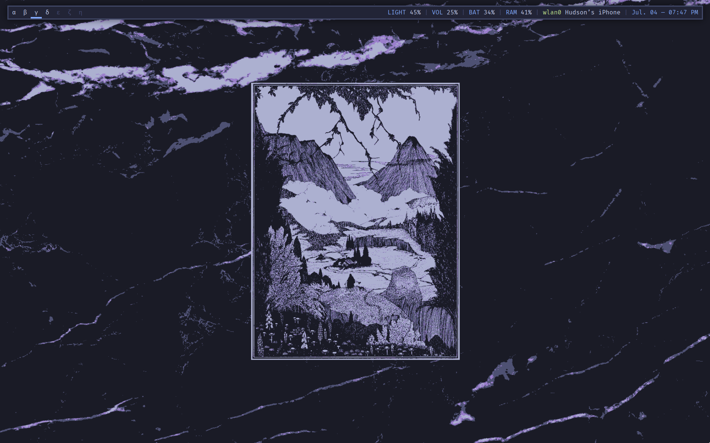
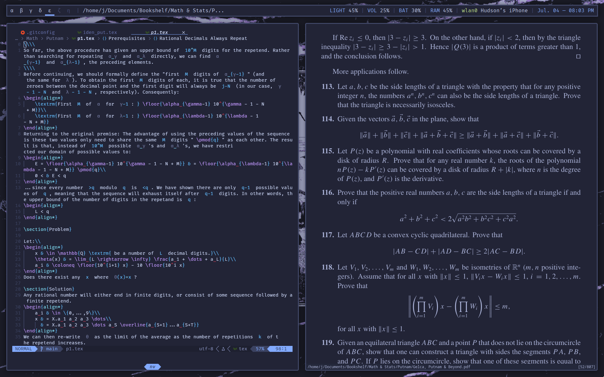

<h1 align="center">
  
  <br>
  Arch Dotfiles (w/ Chezmoi)
  <br>
  
  
</h1>

Dotfiles for a fairly minimal "Tokyo Night"-themed Arch Linux setup. This repo is only updated on a semi-regular basis, and it's entirely tailored to my personal workflow; everything _should_ work OOTB, but I can't guarantee full reproducibility across all machines (though feel free to create a new [issue](https://github.com/Hudson-Liu/Dotfiles/issues) if something is broken).

Also, fair warning: I strongly recommend only testing these dotfiles on a **fresh, blank install of Arch Linux**. These dotfiles _do not work_ unless you specifically use BSPWM, Pipewire/Pulseaudio, and a number of other applications—Chezmoi should auto-install these, but if you already have an existing DE/WM set up, then these dots likely won't work as intended. For a quick fresh install, I recommend using the `archinstall` script and picking the "minimal" preset.

## Installation
> [!IMPORTANT]
> Go through _all files_ in this repo before running `chezmoi init`. Certain directories are tagged with the "exact_" state attribute, so **existing configurations may be deleted without backup**.

```bash
sudo pacman -S chezmoi
chezmoi init --apply Hudson-Liu/Dotfiles
```

After running the second command, Chezmoi will prompt various questions from `.chezmoi.toml.tmpl`.
## Screenshots

| Empty Layout | Floating Layout | Tiled Layout |
|--------------|-----------------|--------------|
|  |  |  |

## Demoes
<div align="center">
  <p><b>Initial Chezmoi Installation/Setup</b></p>
  
</div>

<div align="center">
  <p><b>Python Virtual Environment Selector</b></p>
  
</div>

## Inspiration
- [Manas140's Dotfiles](https://github.com/Manas140/dotfiles)
- [Amogh's Dotfiles](https://github.com/amogh-w/dotfiles)
- [Tudurom's Dotfiles](https://github.com/tudurom/dotfiles)
