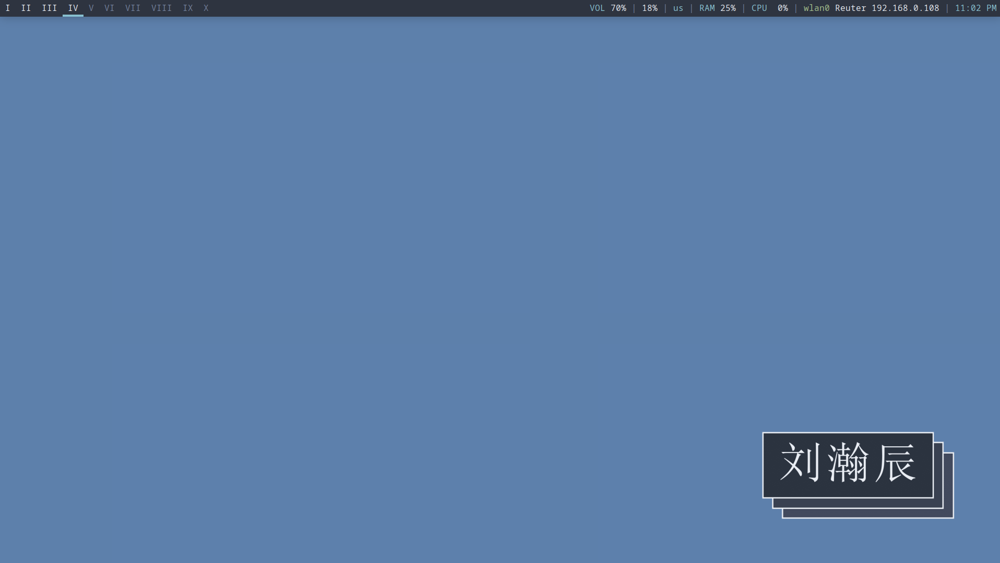
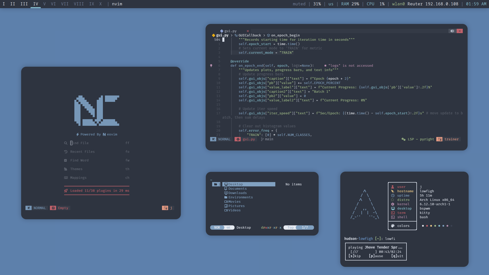
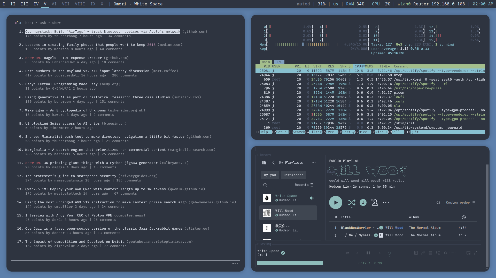

<h1 align="center">
  
   
  Minimal Nord-Themed Dotfiles for Arch
   
  
  
</h1>

Dotfiles for a fairly minimal Nord-themed Arch Linux setup. This repo is only updated on a semi-regular basis; don't expect for everything to work OOTB. I didn't include all configs since I kept most applications somewhat close to default—my rule of thumb is to only add files that would take >1 hr (or annoying trial-and-error) to replicate from scratch.
## Application List
**Base Software**
- *OS*: Arch Linux
- *Display Server*: X11/Xorg
- *Display Manager*: LightDM
- *Window Manager*: BSPWM + SXHKD (and FlashFocus)
- *Application Launcher*: Rofi (as dmenu)
- *Compositor*: Picom
- *Networking*: NetworkManager
- *AUR Helper*: Yay
- *Terminal*: Kitty
- *Status Bar*: Polybar
- *Sound Daemon*: PipeWire

**Other Applications**
- *Sound Front-End*: Pavucontrol
- *Disk Management*: GParted
- *Image Viewer*: Feh
- *IDE/Notes*: Neovim (NvChad)
- *TeX Distro*: TeX Live (pdfTeX + LaTeX)
- *PDF Viewer*: Zathura w/ MuPDF
- *File Explorer:*: Thunar + Thunar-Archive-Plugin + Thunar-Volman
- *Archive Management*: XArchiver + unzip + 7z
- *Video Player*:  mpv
- *Process Monitor*: htop (for cpu) + nvtop (for gpu)
- *Bluetooth*: Blueberry
- *GTK Theming*: Lxappearance
- *Keyboard Backlight*: OpenRGB
- *Screenshot Utility*: Scrot
- *Clipboard CLI Control*: Xclip
- *Source Control*: Git

## Theming
  - GTK Theme: Nord Theme
  - Cursor: BreezeX
  - Font: FiraCode Nerd Font
  - Unicode & Emojis: Noto Color Emoji
## Screenshots

| Empty Layout | Floating Layout | Tiled Layout |
|--------------|-----------------|--------------|
|  |  |  |

## Inspiration
- [Manas140's Dotfiles](https://github.com/Manas140/dotfiles)
- [Amogh's Dotfiles](https://github.com/amogh-w/dotfiles)

